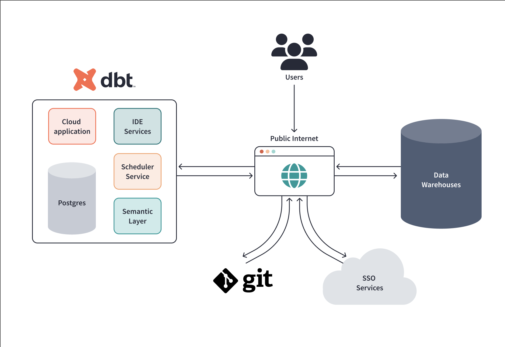

# dlt_zoom_data
### **What is dbt?**
- dbt is a transformation workflow that enhances productivity and quality in analytics by modularizing and centralizing code, similar to software engineering practices.
- It facilitates collaboration, versioning, testing, and documentation of queries before deployment to production, ensuring reliability and visibility.
### **dbt setups**
there are two forms of dbt setups:
- **dbt Core:** This is an open-source command line tool that can be installed locally in your environment, and communication with databases is facilitated through adapters.
- **dbt Cloud:** It runs dbt Core in a hosted environment with a browser-based interface. It is not an open source like dbt core but gives 14 days free trial access.
In addition to the features of dbt core it also provides other features like:
    * Scheduling of jobs, 
    * CI/CD, 
    * Hosting documentation, 
    * Monitoring, and 
    * Alerting.

**dbt cloud architecture** is designed to provide a GUI that enable the developer connect to github for version controlling, access data stored in various data warehouses and transform the data using SQL code packaged in the form of models and macro for Bussiness Inteligence and other reporting requirments.

